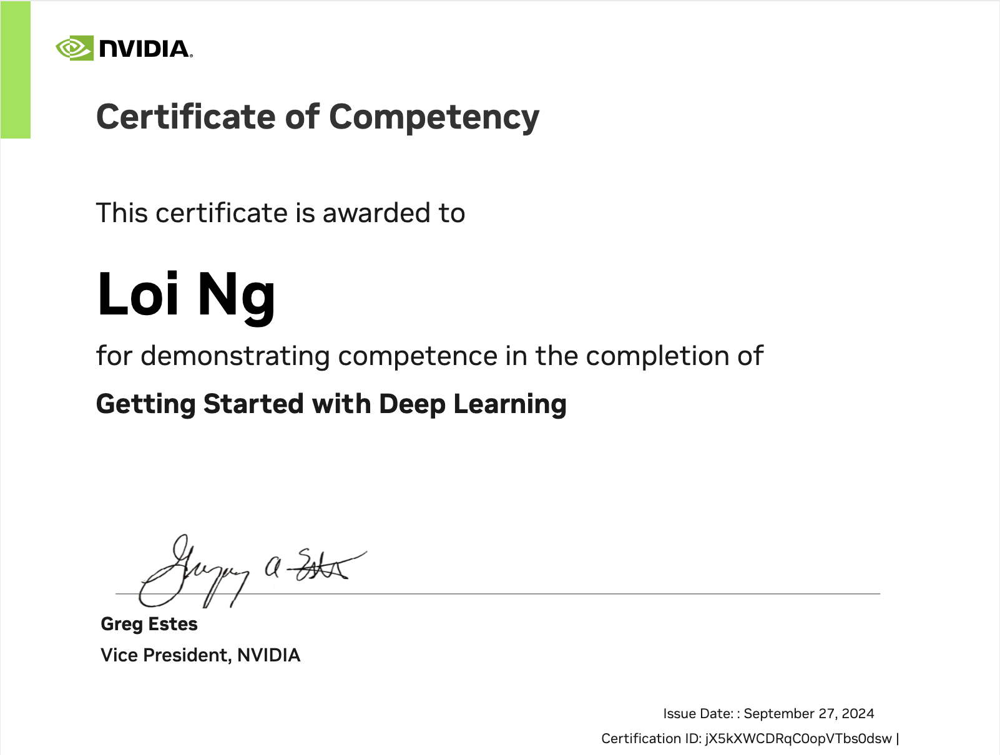

## 全面掌握「Deep Learning 深度学习」

### [AIPM 🌿 COMMUNITY 人工智能产品管理](https://roadmaps.feishu.cn/wiki/RykrwFxPiiU4T7kZ63bc7Lqdnch)

直接从下表运行笔记本：
| 主题 | Colab | Kaggle | 社区 |
| :-------- | :-------- | :------- | :------- |
| | | | |
**深度学习基础知识**
|<ul><li>A Introduction to Deep Learning</li></ul>|<ul><li></li></ul>|<ul><li></li></ul>| [AIPM 🌿](https://www.theforage.cn/community) |
**神经网络的理论**
|<ul><li>How a Neural Network Trains</li></ul>|<ul><li></li></ul>|<ul><li></li></ul>| [AIPM 🌿](https://www.theforage.cn/community) |
**卷积神经网络**
|<ul><li>Convolutional Neural Networks</li></ul>|<ul><li></li></ul>|<ul><li></li></ul>| [AIPM 🌿](https://www.theforage.cn/community) |
**数据增强与模型部署**
|<ul><li>数据增强 Data Augmentation</li><li>部署模型 Deployment</li></ul>|<ul><li></li><li></li></ul>|<ul><li></li><li></li></ul>| [AIPM 🌿](https://www.theforage.cn/community) |
**预训练的模型**
|<ul><li>使用预训练的模型</li><li>迁移学习</li></ul>|<ul><li></li><li></li></ul>|<ul><li></li><li></li></ul>| [AIPM 🌿](https://www.theforage.cn/community) |
**自然语言处理**
|<ul><li>Advanced Architectures</li></ul>|<ul><li></li></ul>|<ul><li></li></ul>| [AIPM 🌿](https://www.theforage.cn/community) |
**总结与评估**
|<ul><li>Wrap Up</li></ul>|<ul><li></li></ul>|<ul><li></li></ul>| [AIPM 🌿](https://www.theforage.cn/community) |

#### [加入社区 🌿 AIPM](https://www.theforage.cn/community)
#### [与我联系 🐬 5LOI](https://5loi.com/about_loi)

